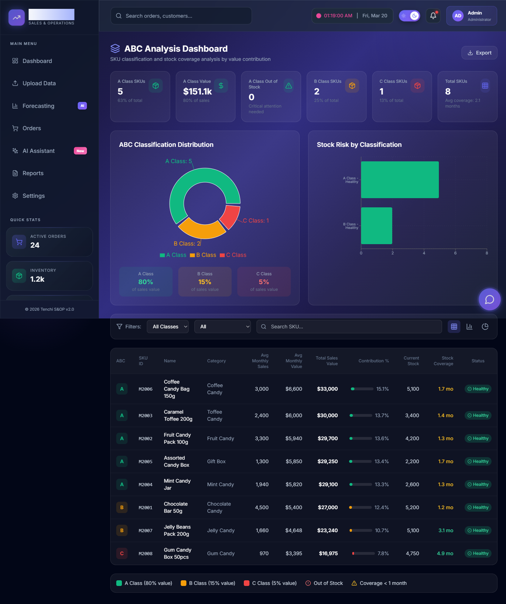
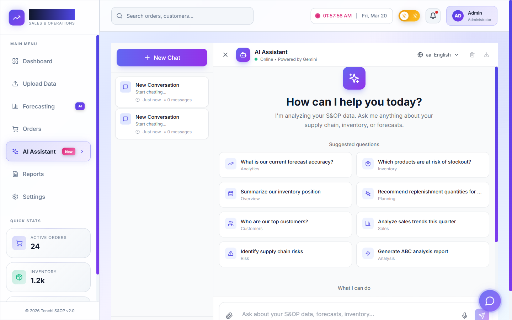
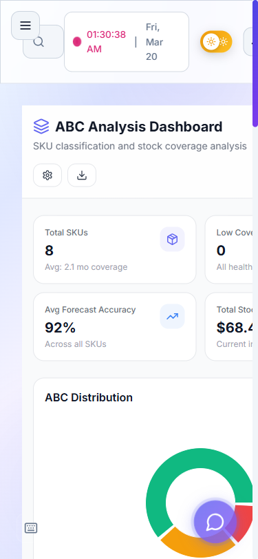

<p align="center">
  
  
  
  
  
  
  
  
</p>

<h1 align="center">TenchiOne</h1>

<p align="center">
  <b>AI-Powered Sales & Operations Planning (S&OP) Platform</b><br>
  <i>Smart Commerce Operations Transformation & Technology (SCOTT)</i><br><br>
  End-to-end supply chain intelligence — from demand forecasting and inventory classification<br>
  to order automation, production planning, container tracking, and AI-driven analytics.
</p>

---

## Table of Contents

- [Overview](#overview)
- [Key Features](#key-features)
- [Tech Stack](#tech-stack)
- [Architecture](#architecture)
- [Getting Started](#getting-started)
- [Environment Variables](#environment-variables)
- [Project Structure](#project-structure)
- [Pages & Modules](#pages--modules)
- [API Reference](#api-reference)
- [Forecasting Engine](#forecasting-engine)
- [AI Assistant](#ai-assistant)
- [SmartOrder Engine](#smartorder-engine)
- [Database Schema](#database-schema)
- [Deployment](#deployment)
- [Security](#security)
- [Design System](#design-system)
- [Development](#development)
- [Screenshots](#screenshots)
- [License](#license)

---

## Overview

TenchiOne is a comprehensive **Sales & Operations Planning (S&OP)** platform designed for enterprises managing complex supply chains. It combines real-time data analytics, AI-powered demand forecasting, automated order processing, and interactive visualizations into a single, modern web application.

The platform ingests Excel/CSV data from distributors and ERP systems, normalizes it through an AI-powered column mapping engine, validates against cached SAP master data, and produces actionable insights across every stage of the supply chain — from procurement through production to final delivery.

**Target Users:** Supply chain managers, demand planners, inventory controllers, procurement teams, and operations leadership.

---

## Key Features

### Dashboard & Analytics
- **S&OP Command Centre** — Real-time KPI cards with sparklines showing revenue, orders, inventory health, and forecast accuracy
- **Interactive Charts** — Area, bar, pie, radar, funnel, heatmap, and composed chart types powered by Recharts
- **3D Visual Elements** — Floating cards and particle backgrounds using React Three Fiber/Drei for a premium feel
- **Smart Greeting** — Contextual welcome messages with live activity feeds and quick-action shortcuts
- **Dark/Light Theme** — Full theme support with system preference detection and manual toggle

### ABC Inventory Analysis
- **Automatic ABC Classification** — Pareto-based classification of materials into A (high-value), B (medium), and C (low-value) categories
- **Inventory Ageing** — Configurable good/slow-moving/bad stock age brackets with industry presets (FMCG, Pharma, Electronics, Automotive)
- **Stock Coverage Calculations** — Months of coverage, out-of-stock risk levels, and gap analysis per SKU
- **Visual Breakdowns** — Pie charts, bar charts, area charts, and radar charts for multi-dimensional analysis
- **Excel Export** — One-click export of classification results

### Demand Forecasting
- **6 Forecasting Algorithms**: Simple Moving Average (SMA), Weighted Moving Average (WMA), Simple Exponential Smoothing (SES), Holt's Method, Linear Regression, and Seasonal Decomposition
- **Accuracy Metrics** — MAPE, RMSE, Bias, and Tracking Signal calculations
- **What-If Scenario Modeling** — Interactive sliders for demand (+/-50%) and safety stock adjustments with quick presets (Optimistic, Baseline, Pessimistic, Promotional)
- **Trend Analysis** — AI-powered detection of trends, risks, seasonality patterns, and anomalies
- **Forecast vs Actual** — Combo charts showing historical accuracy with confidence bands

### Order Management
- **Full Order Lifecycle** — CREATED > CONFIRMED > ALLOCATED > SHIPPED > DELIVERED > INVOICED statuses
- **Credit Hold Management** — Credit status tracking with release workflow
- **SAP Integration** — Sync status tracking (PENDING/SYNCED/FAILED) with SAP order numbers
- **Allocation Engine** — Partial and full allocation tracking with shelf-life constraints
- **Bulk Operations** — Multi-select for batch status updates, exports, and SAP sync

### Order Optimizer
- **Replenishment Prompts** — Automated reorder point calculations based on safety stock, forecast demand, and closing stock
- **Priority Scoring** — High/Medium/Low priority based on stock coverage months
- **Capital Allocation** — Order value estimates with unit pricing for budget planning
- **Coverage Analysis** — Months-of-stock coverage per SKU with in-transit consideration

### Container & Shipment Tracking
- **Live Map Tracking** — Interactive Leaflet map with vessel positions, routes, and port markers
- **Multi-Carrier Support** — Maersk, MSC, Hapag-Lloyd, and more with direct tracking links
- **Status Timeline** — Full history from BOOKED > GATE_IN > LOADED > DEPARTED > IN_TRANSIT > ARRIVED > DELIVERED
- **Container Details** — Type (20/40/40HQ), weight, volume, seal number, B/L number, and contents manifest
- **ETA Monitoring** — Estimated vs actual arrival dates with delay alerts

### Production Planning
- **Bill of Materials (BOM)** — Multi-level BOM management with raw material (RM) and packaging material (PM) lines
- **Production Plans** — Status tracking (CONFIRMED/IN_PRODUCTION/COMPLETED), priority ordering, and material availability checks
- **Vendor ETAs** — Inbound material tracking linked to production schedules
- **Capacity Planning** — Planned quantities against available material stock

### Kitting & Co-Packing
- **Kit Configuration** — Define composite SKUs from component materials
- **Allocation Workflow** — PLANNED > ALLOCATED > ASSEMBLED > READY > SHIPPED lifecycle
- **Assembly Tracking** — Real-time status of kitting operations

### Data Upload & Import
- **Excel/CSV Upload** — Drag-and-drop with react-dropzone, supporting .xlsx, .xls, and .csv
- **AI Column Mapping** — Gemini-powered fuzzy matching of uploaded columns to system fields
- **Live Data Preview** — File metadata analysis showing columns, rows, data types, and unique values
- **Selective Import** — Choose specific columns and rows before ingesting
- **Validation Engine** — Data validation against master records with detailed error reporting

### Reports & Export
- **PDF Reports** — Branded S&OP reports with KPI summaries, inventory analysis, and order tables (jsPDF + autoTable)
- **Excel Export** — Multi-sheet workbooks with KPIs, master data, orders, inventory, and forecast calculations
- **Email Distribution** — Send reports directly via Nodemailer integration
- **Saved Reports** — Configurable report templates stored in the database

### AI Assistant
- **Gemini-Powered Chat** — Full conversational AI analyzing uploaded S&OP data in real-time
- **Multilingual Support** — English and Arabic (RTL) with complete UI translations
- **Data-Grounded Responses** — System prompt forces answers from actual uploaded data, not generic advice
- **Floating Widget** — Accessible from any page via a persistent floating AI button
- **Domain Expertise** — Trained prompts for sales analysis, geographic performance, inventory health, financial breakdown, and forecasting

### Settings & Configuration
- **Inventory Age Master** — Configurable thresholds for good/slow/bad stock classification
- **Industry Presets** — One-click configuration for FMCG, Pharma, Electronics, and Automotive verticals
- **API Key Management** — Gemini API key configuration
- **Email Settings** — SMTP configuration for report distribution

---

## Tech Stack

| Layer | Technology |
|-------|-----------|
| **Framework** | Next.js 14 (App Router, Server Components, Standalone output) |
| **Language** | TypeScript 5.3 |
| **UI Library** | React 18 |
| **Styling** | Tailwind CSS 3.4, Glassmorphism design, CSS custom properties |
| **Animation** | Framer Motion |
| **3D Graphics** | Three.js + React Three Fiber + Drei |
| **Charts** | Recharts, Chart.js + react-chartjs-2 |
| **Maps** | Leaflet + React-Leaflet |
| **Data Tables** | TanStack React Table v8 |
| **Authentication** | Clerk (SSO, social login, session management) |
| **Database** | SQLite (dev) / PostgreSQL (prod) via Prisma ORM |
| **AI/ML** | Google Gemini (generative AI, fuzzy matching, column mapping, validation) |
| **File Parsing** | SheetJS (xlsx) for Excel, pdfjs-dist + react-pdf for PDF |
| **PDF Generation** | jsPDF + jspdf-autotable |
| **Email** | Nodemailer |
| **Validation** | Zod schema validation |
| **State Management** | React Context (DataProvider), localStorage persistence |
| **Icons** | Lucide React |
| **Notifications** | react-hot-toast |
| **Deployment** | Vercel (primary), Docker + Docker Compose, standalone Node.js |
| **CI/CD** | GitHub Actions |
| **Caching** | Redis (Docker Compose stack) |

---

## Architecture

```
                    +------------------+
                    |   Clerk Auth     |
                    |   (Middleware)   |
                    +--------+---------+
                             |
                    +--------v---------+
                    |   Next.js 14     |
                    |   App Router     |
                    +--------+---------+
                             |
          +------------------+------------------+
          |                  |                  |
  +-------v-------+  +------v------+  +--------v--------+
  |  Client Pages |  |  API Routes |  |   Static Assets  |
  |  (React 18)   |  |  (/api/*)   |  |   (public/)      |
  +-------+-------+  +------+------+  +-----------------+
          |                  |
  +-------v-------+  +------v------+
  | DataContext    |  | Prisma ORM  |
  | (localStorage) |  | (SQLite/PG) |
  +---------------+  +------+------+
                             |
          +------------------+------------------+
          |                  |                  |
  +-------v-------+  +------v------+  +--------v--------+
  | Gemini AI     |  | SAP Service |  | Email (SMTP)     |
  | (Assistant,   |  | (Mock/Live) |  | (Nodemailer)     |
  |  Mapping, AI) |  +-------------+  +-----------------+
  +---------------+
```

---

## Getting Started

### Prerequisites

- **Node.js** >= 18.0.0
- **npm** >= 9.0.0
- A **Clerk** account for authentication (free tier available)
- (Optional) **Google Gemini API key** for AI features
- (Optional) **Docker** for containerized deployment

### Installation

```bash
# Clone the repository
git clone https://github.com/batmandevx/techni.git
cd techni

# Install dependencies
npm install

# Copy environment template and configure
cp .env.example .env.local

# Generate Prisma client
npm run db:generate

# Run database migrations
npm run db:migrate

# (Optional) Seed with sample data
npm run db:seed

# Start development server
npm run dev
```

Open [http://localhost:3000](http://localhost:3000) in your browser. The landing page provides login/signup links powered by Clerk.

### Quick Database Setup (All-in-One)

```bash
npm run db:setup
# Runs: prisma generate → prisma migrate dev --name init → seed
```

### Reset Database

```bash
npm run db:reset
# Runs: prisma migrate reset --force → seed
```

---

## Environment Variables

| Variable | Required | Default | Description |
|----------|----------|---------|-------------|
| `DATABASE_URL` | Yes | `file:./dev.db` | Database connection string (SQLite for dev, PostgreSQL for prod) |
| `GEMINI_API_KEY` | No | — | Google Gemini API key for AI assistant, column mapping, and validation |
| `SMARTORDER_STORAGE` | No | `prisma` | Storage backend for SmartOrder engine |
| `NEXT_PUBLIC_APP_URL` | No | `http://localhost:3000` | Public application URL |
| `NEXT_PUBLIC_CLERK_PUBLISHABLE_KEY` | Yes | — | Clerk publishable key for frontend auth |
| `CLERK_SECRET_KEY` | Yes | — | Clerk secret key for backend auth |
| `NEXTAUTH_URL` | No | — | Legacy auth URL (if using NextAuth alongside Clerk) |
| `NEXTAUTH_SECRET` | No | — | Legacy auth secret |
| `REDIS_URL` | No | — | Redis connection for caching (Docker stack) |
| `SAP_SERVICE_URL` | No | — | SAP integration service endpoint |
| `SAP_MOCK` | No | `true` | Use mock SAP service instead of live connection |

---

## Project Structure

```
techni/
├── .github/
│   └── workflows/
│       └── ci.yml                  # GitHub Actions CI pipeline
├── prisma/
│   ├── schema.prisma               # Database schema (6 models)
│   ├── migrations/                  # Database migrations
│   ├── seed.ts                      # General seed data
│   ├── seed-smartorder.ts           # SmartOrder-specific seed data
│   └── dev.db                       # SQLite development database
├── public/                          # Static assets (images, fonts, icons)
├── sap-service/                     # SAP integration microservice
├── scripts/                         # Utility scripts
├── data/                            # Data files directory
├── uploads/                         # Uploaded file storage
├── src/
│   ├── app/
│   │   ├── layout.tsx               # Root layout (ClerkProvider, metadata)
│   │   ├── layout-client.tsx        # Client layout (Sidebar, Header, DataProvider, FloatingAI)
│   │   ├── page.tsx                 # Landing page (hero, features, CTA)
│   │   ├── globals.css              # Global styles
│   │   ├── middleware.ts            # Clerk auth middleware (public/protected routes)
│   │   ├── loading.tsx              # Global loading state
│   │   ├── error.tsx                # Error boundary page
│   │   ├── not-found.tsx            # 404 page
│   │   ├── global-error.tsx         # Global error boundary
│   │   │
│   │   ├── main/                    # S&OP Command Centre dashboard
│   │   ├── abc-dashboard/           # ABC inventory analysis
│   │   ├── forecasting/             # Demand forecasting & what-if modeling
│   │   ├── optimizer/               # Order optimizer & replenishment prompts
│   │   ├── orders/                  # Order management & lifecycle
│   │   ├── containers/              # Container & shipment tracking
│   │   ├── production/              # Production planning & BOM
│   │   ├── kitting/                 # Kitting & co-packing operations
│   │   ├── upload/                  # Data upload & AI import
│   │   ├── ai-assistant/            # Full-page AI assistant chat
│   │   ├── reports/                 # Report generation & export
│   │   ├── settings/                # Platform configuration
│   │   ├── smartorder/              # SmartOrder automation hub
│   │   ├── dashboard/               # SmartOrder dashboard
│   │   ├── auth/                    # Authentication pages
│   │   │
│   │   └── api/                     # API routes
│   │       ├── ai/                  # AI endpoints (fuzzy-match, map-columns, validate)
│   │       ├── analytics/           # Analytics (KPIs, orders-trend, top-customers)
│   │       ├── batches/             # Order batch CRUD
│   │       ├── chat/                # Chat history persistence
│   │       ├── customers/           # Customer master data
│   │       ├── dashboard/           # Dashboard aggregation
│   │       ├── email/               # Email sending
│   │       ├── forecasting/         # Forecast calculations
│   │       ├── gemini/              # Gemini AI proxy
│   │       ├── health/              # Health check endpoint
│   │       ├── master-data/         # Master data management
│   │       ├── materials/           # Material master data
│   │       ├── orders/              # Order CRUD & SAP sync
│   │       ├── templates/           # Report templates
│   │       └── upload/              # File upload handling
│   │
│   ├── components/
│   │   ├── 3d/                      # FloatingCard3D, ParticleBackground (Three.js)
│   │   ├── ai/                      # ChatInput, ChatMessage, ChatSidebar, FloatingAIAssistant
│   │   ├── charts/                  # Area, Bar, Pie, Radar, Funnel, Heatmap, Sankey, Composed
│   │   ├── dashboard/               # KPICard, SmartInsights, ActivityFeed, InventoryTracker, etc.
│   │   ├── error/                   # ErrorBoundary, ErrorFallback
│   │   ├── layout/                  # Sidebar, TopBar, FloatingActionButton
│   │   ├── smart-order/             # SmartOrder UI components
│   │   ├── smartorder/              # SmartOrder feature components
│   │   ├── ui/                      # Shared UI primitives
│   │   ├── CommandPalette.tsx        # Cmd+K command palette
│   │   ├── ExportButton.tsx          # Universal export button
│   │   ├── FloatingChatbot.tsx       # Floating chat widget
│   │   ├── KeyboardShortcuts.tsx     # Keyboard shortcut handler
│   │   ├── MapTracking.tsx           # Leaflet map for container tracking
│   │   ├── Notifications.tsx         # Notification center
│   │   ├── OrderModal.tsx            # Order detail modal
│   │   ├── SearchBar.tsx             # Global search
│   │   ├── ThemeToggle.tsx           # Dark/light mode toggle
│   │   └── Toast.tsx                 # Toast notifications
│   │
│   ├── lib/
│   │   ├── DataContext.tsx           # Global data state (React Context)
│   │   ├── AuthContext.tsx           # Authentication context
│   │   ├── ThemeContext.tsx          # Theme management context
│   │   ├── forecasting.ts           # Forecasting engine (6 algorithms, ABC, ageing)
│   │   ├── geminiService.ts         # Gemini AI integration (chat, system prompts)
│   │   ├── calculations.ts          # Financial & inventory calculations
│   │   ├── uploadDataStore.ts       # Upload data persistence layer
│   │   ├── workbook-parser.ts       # Excel/CSV parsing utilities
│   │   ├── pdf-export.ts            # PDF report generation
│   │   ├── prisma.ts                # Prisma client singleton
│   │   ├── validators.ts            # Zod validation schemas
│   │   ├── utils.ts                 # Shared utilities (cn, formatting)
│   │   ├── hooks/                   # Custom React hooks
│   │   └── smart-order/             # SmartOrder business logic
│   │
│   └── middleware.ts                # Clerk auth route protection
│
├── Dockerfile                       # Multi-stage production Docker build
├── docker-compose.yml               # Full stack (app + PostgreSQL + Redis + SAP service)
├── docker-compose.smartorder.yml    # SmartOrder-specific compose
├── next.config.js                   # Next.js configuration (security headers, webpack splits)
├── tailwind.config.ts               # Tailwind configuration (Outfit font, custom colors)
├── vercel.json                      # Vercel deployment configuration
├── tsconfig.json                    # TypeScript configuration
└── package.json                     # Dependencies and scripts
```

---

## Pages & Modules

| Route | Page | Description |
|-------|------|-------------|
| `/` | Landing Page | Hero section with feature cards, login/signup CTAs |
| `/main` | S&OP Command Centre | Primary dashboard with KPIs, revenue charts, category breakdown, ABC distribution, radar metrics, and live activity feed |
| `/abc-dashboard` | ABC Analysis | Inventory classification with ageing, stock coverage, risk levels, and configurable thresholds |
| `/forecasting` | Demand Forecasting | 6 algorithms, KPI stat cards, trend charts, accuracy metrics, and what-if scenario sliders |
| `/optimizer` | Order Optimizer | Replenishment prompt calculations, priority scoring, and capital allocation planning |
| `/orders` | Order Management | Full order lifecycle tracking with credit holds, SAP sync, allocation, and bulk operations |
| `/containers` | Container Tracking | Interactive map with vessel positions, status timelines, multi-carrier support, and ETA monitoring |
| `/production` | Production Planning | BOM management, production plan tracking, vendor ETA integration, and capacity checks |
| `/kitting` | Kitting Operations | Composite SKU configuration, allocation workflow, and assembly status tracking |
| `/upload` | Data Upload | Drag-and-drop file import with AI column mapping, preview, validation, and selective ingestion |
| `/ai-assistant` | AI Assistant | Full-page Gemini-powered chat with multilingual support (EN/AR) and data-grounded analysis |
| `/reports` | Reports | PDF and Excel report generation with email distribution and saved templates |
| `/settings` | Settings | Inventory age configuration, industry presets, API keys, and email settings |
| `/smartorder` | SmartOrder Hub | Automation dashboard for batch processing, AI mapping confidence, and order analytics |
| `/dashboard` | SmartOrder Dashboard | Order automation stats, batch management, and processing overview |
| `/auth` | Authentication | Clerk-powered sign-in/sign-up flows |

---

## API Reference

| Endpoint | Method | Description |
|----------|--------|-------------|
| `/api/health` | GET | Health check with memory usage and uptime |
| `/api/analytics` | GET | Dashboard KPIs (orders, value, customers, materials) |
| `/api/analytics/orders-trend` | GET | Daily order trend data |
| `/api/analytics/top-customers` | GET | Top customers by order volume/value |
| `/api/ai/fuzzy-match` | POST | AI-powered fuzzy column name matching |
| `/api/ai/map-columns` | POST | Automatic column mapping via Gemini |
| `/api/ai/validate` | POST | AI-powered data validation |
| `/api/batches` | GET/POST | Order batch CRUD |
| `/api/batches/[id]` | GET/PUT/DELETE | Individual batch operations |
| `/api/chat` | GET/POST | Chat message persistence |
| `/api/customers` | GET/POST | Customer master data |
| `/api/dashboard` | GET | Dashboard aggregation endpoint |
| `/api/email` | POST | Send email reports |
| `/api/forecasting` | GET/POST | Forecast calculations |
| `/api/gemini` | POST | Gemini AI proxy endpoint |
| `/api/master-data` | GET/POST | Master data management |
| `/api/materials` | GET/POST | Material master data |
| `/api/orders` | GET/POST | Order CRUD with SAP sync |
| `/api/templates` | GET/POST | Report template management |
| `/api/upload` | POST | File upload and processing |

---

## Forecasting Engine

The forecasting engine in `src/lib/forecasting.ts` implements six statistical algorithms:

### Simple Moving Average (SMA)
```
SMA = (P1 + P2 + ... + Pn) / n
```
Best for stable demand patterns with minimal trend or seasonality.

### Weighted Moving Average (WMA)
```
WMA = (w1*P1 + w2*P2 + ... + wn*Pn) / (w1 + w2 + ... + wn)
```
Best for gradual trend changes — assigns higher weight to recent periods.

### Simple Exponential Smoothing (SES)
```
Forecast = alpha * Actual + (1 - alpha) * Previous_Forecast
```
Best for data without trend or seasonality — uses exponential decay weighting.

### Holt's Method (Double Exponential Smoothing)
```
Level = alpha * Actual + (1 - alpha) * (Previous_Level + Trend)
Trend = beta * (Level - Previous_Level) + (1 - beta) * Previous_Trend
```
Best for trending data — separately tracks level and trend components.

### Linear Regression
```
Y = a + bX
```
Best for strong linear trends — projects the trend line forward.

### Seasonal Decomposition
```
Forecast = Trend * Seasonal_Index
```
Best for seasonal products — isolates and projects seasonal patterns.

### Accuracy Metrics
- **MAPE** (Mean Absolute Percentage Error) — Overall forecast accuracy
- **RMSE** (Root Mean Square Error) — Error magnitude
- **Bias** — Systematic over/under forecasting
- **Tracking Signal** — Forecast drift detection

---

## AI Assistant

The AI assistant integrates Google Gemini (via `@google/generative-ai`) to provide data-grounded S&OP analysis:

- **System Prompt Engineering** — The assistant is constrained to answer ONLY from uploaded data, citing specific numbers, SKUs, months, and categories
- **Data Context Building** — Automatically constructs context from uploaded files, current datasets, and dashboard metrics
- **Multilingual** — Full English and Arabic support with RTL layout
- **Floating Access** — Available from every page via `FloatingAIAssistant` component
- **Analysis Domains**:
  - Sales & Orders (total value, profit analysis, forecasts, target vs actual)
  - Geographic Analysis (country-wise performance, market penetration)
  - Inventory & Supply Chain (classification, ageing, container tracking)
  - Financial Analysis (P&L breakdown, margin analysis, cost structure)
  - Forecasting & Planning (demand forecasts, accuracy analysis, multi-year comparisons)

---

## SmartOrder Engine

The SmartOrder engine automates distributor spreadsheet processing into SAP-ready sales orders:

1. **Upload** — Drag-and-drop Excel/CSV files from distributors
2. **AI Column Mapping** — Gemini analyzes headers and maps them to system fields with confidence scores
3. **Validation** — Rows validated against CustomerMaster and MaterialMaster records
4. **Processing** — Valid rows converted into OrderLine records linked to OrderBatch
5. **SAP Sync** — Processed orders can be synced to SAP (mock or live)
6. **MIS Reporting** — Analytics dashboard showing batch performance, success rates, and trends

---

## Database Schema

The Prisma schema (`prisma/schema.prisma`) defines 10 models across 5 domains:

### User Management
- **User** — Accounts with roles (ADMIN, OPERATOR, VIEWER) and Clerk integration

### Master Data
- **CustomerMaster** — Customer records with SAP org structure, credit limits, and geographic data
- **MaterialMaster** — Material/SKU records with pricing, categorization, and UoM
- **PricingCondition** — Condition-based pricing (PR00, K004, MWST, KF00) with validity periods

### Order Processing
- **OrderBatch** — Batch upload containers with status lifecycle and AI mapping confidence
- **OrderLine** — Individual order lines with SAP integration fields and validation tracking

### Audit & Logging
- **AuditLog** — Full audit trail for uploads, validations, order creation, and exports

### AI & Analytics
- **ChatMessage** — Persistent AI chat history per user
- **DailyMetric** — Aggregated daily analytics for trend dashboards
- **SavedReport** — Configurable report templates with filters and scheduling

---

## Deployment

### Vercel (Recommended)

```bash
npm i -g vercel
vercel --prod
```

Configuration is in `vercel.json` — deploys to `iad1` region with 30s API function timeout.

### Docker

```bash
# Single container
npm run docker:build
npm run docker:run

# Full stack (app + PostgreSQL + Redis + SAP service)
npm run docker:compose
```

The Docker Compose stack includes:
- **app** — Next.js application (standalone output)
- **db** — PostgreSQL 16
- **redis** — Redis 7 (Alpine)
- **sap-service** — SAP integration microservice (mock or live)

The Dockerfile uses a multi-stage build with a non-root user, health checks, and optimized layer caching.

### Manual

```bash
npm run build
npm start
```

---

## Security

- **Authentication** — Clerk middleware protects all routes except `/`, `/auth`, `/sign-in`, `/sign-up`, and `/api/webhook`
- **CORS** — Configurable origin restriction (wildcard in dev, locked to `NEXTAUTH_URL` in prod)
- **Security Headers** — HSTS, X-Frame-Options (DENY for API, SAMEORIGIN for pages), X-XSS-Protection, X-Content-Type-Options, Referrer-Policy
- **CSRF Protection** — CSRF token header support on API routes
- **Non-root Docker** — Production container runs as `nextjs:nodejs` (UID 1001)
- **Input Validation** — Zod schemas for API request validation
- **Error Boundaries** — Graceful error handling at page and global levels
- **Powered-By Header** — Disabled to prevent technology fingerprinting

---

## Design System

| Token | Value | Usage |
|-------|-------|-------|
| **Brand** | TenchiOne | Platform name |
| **Font** | Outfit, Inter, system-ui | Primary typeface |
| **Background** | `#080d1a` | Main dark background |
| **Accent** | Indigo-500 to Violet-600 gradient | Buttons, active states, CTAs |
| **Success** | Emerald-500 `#22c55e` | Positive metrics, completed states |
| **Warning** | Amber-500 `#f59e0b` | Caution states, slow-moving inventory |
| **Error** | Rose-500 `#ef4444` | Errors, critical alerts, bad stock |
| **Cards** | `rgba(255,255,255,0.03)` with `rgba(255,255,255,0.07)` border | Glassmorphism panels |
| **Border Radius** | `rounded-2xl` (16px) / `rounded-3xl` (24px) | Cards and containers |
| **Animations** | Framer Motion spring (stiffness: 100, damping: 15) | Page transitions, hover effects |

---

## Development

```bash
# Start dev server
npm run dev

# Type checking
npm run type-check

# Linting
npm run lint

# Production build
npm run build

# Bundle analysis
npm run analyze

# Clean build artifacts
npm run clean

# Database operations
npm run db:generate    # Generate Prisma client
npm run db:migrate     # Run migrations
npm run db:seed        # Seed database
npm run db:reset       # Reset and re-seed
npm run db:setup       # Full setup (generate + migrate + seed)
```

### Requirements
- Node.js >= 18.0.0
- npm >= 9.0.0

---

## Screenshots

<p align="center">
  <br>
  <i>ABC Analysis Dashboard with inventory classification and ageing</i>
</p>

<p align="center">
  <br>
  <i>AI Assistant powered by Gemini with data-grounded S&OP analysis</i>
</p>

<p align="center">
  <br>
  <i>Fully responsive mobile layout</i>
</p>

---

## License

MIT License - see LICENSE file for details.

---

<p align="center">
  Built with Next.js, React, TypeScript, Tailwind CSS, Prisma, Clerk, and Google Gemini AI
</p>
